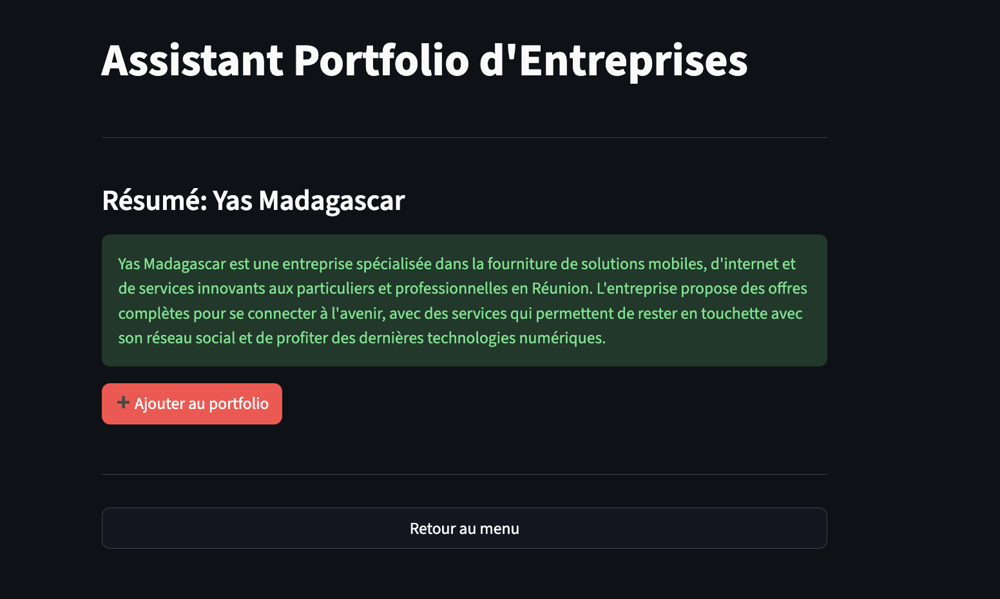
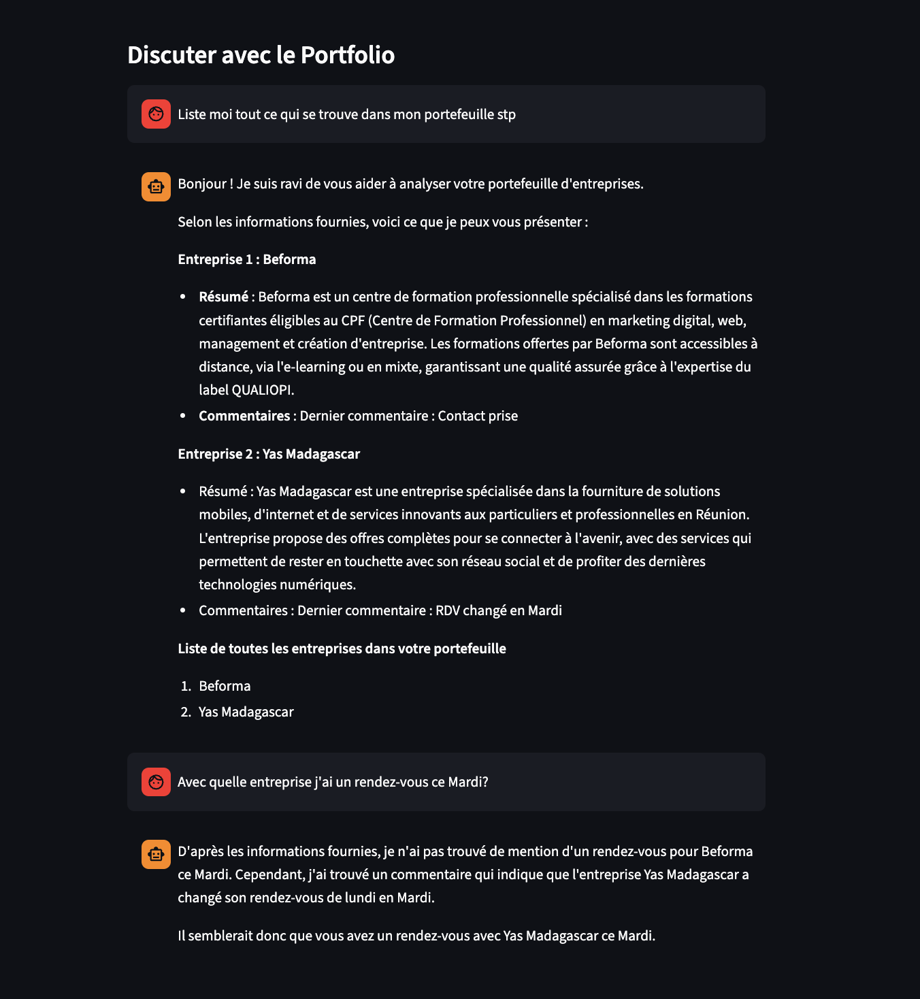

## Objectif du Projet

Ce projet vise à créer un **système intelligent de gestion de portefeuille d'entreprises** permettant aux utilisateurs de :

1.  **Rechercher et enregistrer** automatiquement de nouvelles entreprises dans un portefeuille.
2.  **Générer un résumé** professionnel et concis pour chaque entreprise, en utilisant la recherche web et l'intelligence artificielle (LLM).
3.  **Ajouter des commentaires** d'analyse ou de suivi sur les entreprises enregistrées.
4.  **Interroger le portefeuille** en **langage naturel** (RAG - Retrieval-Augmented Generation) pour obtenir des informations, des comparaisons, ou des synthèses basées sur les données internes.


## Architecture Choisie

L'architecture du projet est basée sur trois composants principaux :

### 1. **Web Search & Extraction**
* **Rôle :** Collecter les informations initiales sur une entreprise.
* **Flux :** Utilise l'API Google pour la recherche, **Playwright** pour scraper le contenu textuel, puis **Ollama** pour générer un résumé structuré.
* **Avantage :** Vitesse d'exécution. Les tentatives précédentes avec LangChain et WebSearch étaient plus lentes.

### 2. **Portfolio Manager**
* **Rôle :** Stocker, gérer et mettre à jour les données du portefeuille.
* **Stockage :** Fichier **CSV** (`PORTFOLIO_FILE`).

### 3. **Retrieval-Augmented Generation (RAG)**
* **Rôle :** Rendre les données du CSV interrogeables en langage naturel.
* **Composants :** **LangChain**, **OllamaEmbeddings**, **FAISS** (Vector Store), et **OllamaLLM** pour la génération finale.


---

## Choix Techniques

| Domaine | Outil/Technologie                                                   | Rôle                                                                              |
| :--- |:--------------------------------------------------------------------|:----------------------------------------------------------------------------------|
| **LLM / Embedding** | **Ollama** (Modèle LLaMA 3) | Large choix de modèles et gratuite. |
| **Vector Store** | **FAISS**                                                           | Base de données vectorielle pour la recherche de similarité.                      |
| **Orchestration** | **LangChain**                                                       | Framework pour construire la chaîne RAG.                                          |

### Contrainte

Le Vector Store n'est pas à jours lorsque les nouvelles entrées du CSV et on doit tout reconstruire à chaque modification.

---

## Instructions 

### 1. Configuration des Clés

* `GOOGLE_API_KEY` et `GOOGLE_CX`
* `OLLAMA_MODEL` (e.g., `"llama3.2:3b"`) et `OLLAMA_API`

### 2. Démarrage des Services
```bash
docker-compose up --build 
```
### 3. Exemple de fichier `.env`

```env
# API Keys
GOOGLE_API_KEY=your_google_api_key
GOOGLE_CX=your_google_cx
GOOGLE_API_URL=https://www.googleapis.com/customsearch/v1

# Ollama Configuration
OLLAMA_API_URL=http://ollama:11434/api/chat
OLLAMA_API=http://ollama:11434
OLLAMA_MODEL=llama3.2:3b

# Paths
DATA_DIR=data
PORTFOLIO_FILE=portfolio_entreprises.csv
VECTORSTORE_DIR=vectorstore
VECTOR_STORE_PATH=portfolio_vectorstore

```
### 4. Captures




[Recording](https://www.loom.com/share/a69b6976633e4e4bb897dc0fae9d13a6)